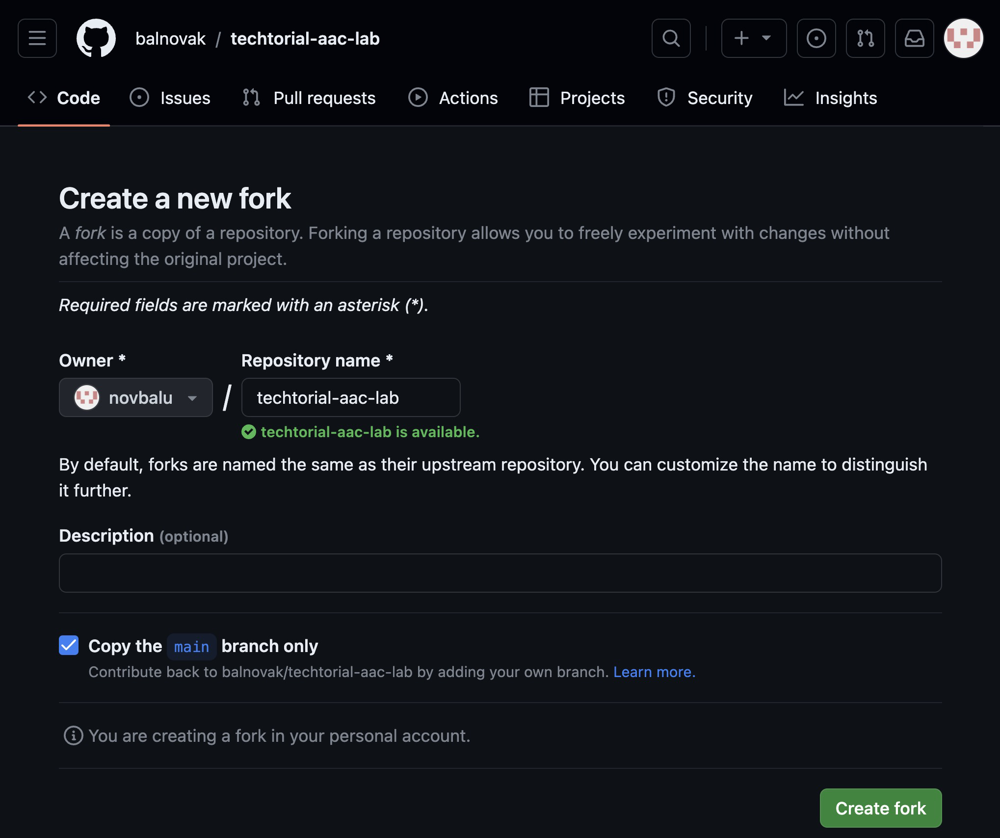
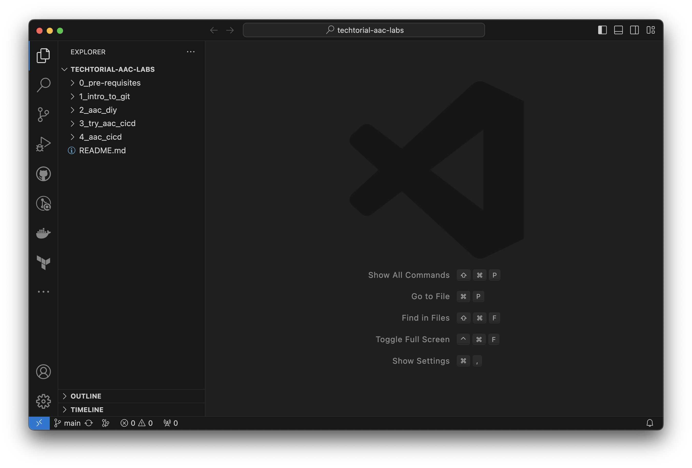

# Lab 1: Introduction to Git

## Goal

Get familiar with Git.


## Code Overview

The repository for this lab ([here](https://github.com/balnovak/techtorial-aac-lab)) contains some sample ACI as Code files that will provision infrastructure onto the DevNet Sandbox ACI simulator. In the following sections, we will make some modifications to the repo step by step and sync all changes with Git.

Note that this lab will only focus on `Git`, subsequent labs will focus on ACI as Code.


## Fork repository
As a first step, we will fork the repository into your own Github account. A fork is a copy of a project. Forking a repository allows you to make changes without affecting the original project.

You will find a `Fork` button above the repository. You will be presented with the option about which account the repository should be forked to. In this lab, we will fork it into your personal Github account.



## Clone repository

Once the repository has been forked it is time to clone the repository from our repository instance. To do so, go to [Github](https://github.com/) and click on the repository you would like to clone. For this lab we will clone the [https://github.com/`<your_user_name>`/techtorial-aac-lab).git](https://github.com/) repository.

You will find a `Code` button above the repository. You will be presented with two options `Clone with SSH` and `Clone with HTTP`. In this lab, we will clone through HTTP. Copy the URL that is shown for HTTP.


Go to a terminal and select the folder where you want to store the repository. Then, clone the Git repository as follows:

```sh
~/prompt> git clone https://github.com/`<your_user_name>`/techtorial-aac-lab.git <folder_name>
```

As an example:

```sh
~/prompt> git clone https://github.com/novbalu/techtorial-aac-lab.git techtorial-aac-labs  
Cloning into 'techtorial-aac-labs'...
remote: Enumerating objects: 3, done.
remote: Counting objects: 100% (3/3), done.
remote: Compressing objects: 100% (2/2), done.
remote: Total 3 (delta 0), reused 0 (delta 0), pack-reused 0
Receiving objects: 100% (3/3), done.
```

You will see that the remote Github repository is now available in your local environment in a directory called `techtorial-aac-labs`. You can now open this folder in your IDE. You should see this:



You are now ready to start to make changes to this (local) repository.

## Git remote

As a next step, let's have a quick look at how Git is structured. Git has a working directory, a staging area and a remote repository. So how does this tie together? Let's have a quick look.

After performing the `git clone` operation, you now have a local repository where you can make changes. This local repository is linked to a remote repository, e.g. the one on Github. In order to see the relation between both, issue the `git remote` command. The `git remote` command lets you create, view, and delete connections to other repositories.

```sh
~/prompt> git remote -v
origin	https://github.com/novbalu/techtorial-aac-lab.git (fetch)
origin	https://github.com/novbalu/techtorial-aac-lab.git (push)
upstream	https://github.com/balnovak/techtorial-aac-lab.git (fetch)
upstream	https://github.com/balnovak/techtorial-aac-lab.git (push)
```

This essentially tells that your local repository is known to Git as 'origin' and the remote repository linked to it can be found at the shown URL. This will become more clear when pushing changes to the remote repository later on in this guide.

## Changing the code

As the repository is now available locally, you can go ahead and make changes to it. Use your IDE to make some changes to the 1_intro_to_git/sudoku.txt file. You can add your name and/or make a few moves.


## Git status

At this point, we have made some changes in our working directory but we have not staged them or sync them to our remote repository. To check this out, use the `git status` command. This command displays the state of the working directory and the staging area. It lets you see which changes have been staged and which haven't.